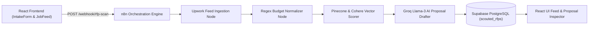

# Upwork Bid Agent 🚀
### Autonomous Freelance RFP Intelligence & Auto-Proposal Copilot

An intelligent, autonomous freelance RFP scouting and proposal generator monorepo powered by **React 18**, **Tailwind CSS v4**, **n8n Orchestration Engine**, **Supabase PostgreSQL**, **Pinecone Vector Database**, and **Groq & Cohere AI LLMs**.

---

## 🌟 Key Features

- 🎯 **Intake Profile & Targeting**: Customizable client profile intake capturing role, target skills, hourly/fixed budget thresholds, and tailored proof-of-work project links.
- 📡 **Automated RFP Ingestion & Parsing**: Real-time RSS feed parsing and structure normalization for freelance job listings.
- 🧮 **Regex Budget Normalizer**: Intelligent extraction and conversion of fixed-price budgets and hourly rate ranges into standardized numerical thresholds.
- 🤖 **Semantic Matcher & Scorer**: Vector-based semantic scoring evaluating job descriptions against candidate profile vectors using Cohere & Pinecone.
- ✍️ **AI Proposal Drafter**: Context-aware proposal generation powered by Groq Llama-3 LLM with tone injection (Direct Technical, Conversational, Pitch) and proof-of-work citation.
- 📊 **Interactive Feed & Metrics Dashboard**: Real-time React frontend dashboard with TanStack Query caching, job filter metrics bar, modal proposal inspector, and copy-to-clipboard functionality.
- 💾 **Supabase Database Persistence**: Persistent storage of scouted RFPs with fit scores, identified pain points, and customized proposals stored in PostgreSQL (`scouted_rfps` table with indexing and RLS security policies).

---

## 🏗️ Architecture & Data Flow



---

## 🛠️ Tech Stack

| Component | Technology | Description |
| :--- | :--- | :--- |
| **Frontend** | React 18, Vite, Tailwind CSS v4 | Lightweight UI dashboard with responsive components |
| **State & Data Fetching** | TanStack React Query v5 | Efficient server state management and background refetching |
| **Authentication** | Clerk Auth (`@clerk/clerk-react`) | Authentication wrapper for user profiles |
| **Orchestration Backend** | n8n | Node-based workflow automation engine |
| **Database** | Supabase (PostgreSQL) | Structured storage for scouted job listings and proposals |
| **Vector Search** | Pinecone Vector Database | High-dimensional semantic indexing and similarity search |
| **LLM & Inference** | Groq Cloud API, Cohere API | Fast AI proposal generation and semantic embeddings |

---

## 📁 Monorepo Structure

```text
upwork-bid-agent/
├── frontend/                     # React 18 + Vite Frontend Application
│   ├── src/
│   │   ├── components/           # UI Components (IntakeForm, JobFeed, JobCard, ProposalModal)
│   │   ├── context/              # SearchFilterContext state provider
│   │   ├── services/             # Webhook service & API connectors
│   │   ├── App.jsx               # Main React Application shell
│   │   └── main.jsx              # Application entrypoint with Clerk provider
│   ├── package.json
│   └── vite.config.js
├── n8n/                          # n8n Orchestration Backend Assets
│   ├── migrations/               # PostgreSQL schema migrations (01_scouted_rfps_schema.sql)
│   ├── scripts/                  # Integration test & validation scripts
│   ├── workflows/                # Complete exported n8n workflow JSONs
│   │   ├── 01-rss-ingestion.json
│   │   ├── 02-filter-normalizer.json
│   │   ├── 03-semantic-scorer.json
│   │   ├── 04-proposal-drafter.json
│   │   ├── 05-phase1-smoke-test.json
│   │   ├── 06-production-cloud-migration.json
│   │   └── 07-phase2-cloud-smoke-test.json
│   ├── Dockerfile                # Production Docker container definition
│   └── .dockerignore
├── .env.example                  # Environment variable template
├── package.json                  # Root monorepo scripts
└── README.md                     # Project documentation
```

---

## 🚀 Local Setup & Quickstart

### Prerequisites

- **Node.js**: v18.0.0 or higher
- **npm**: v9.0.0 or higher
- **Docker** (Optional, for running n8n in container mode)

---

### Step 1: Clone Repository & Install Dependencies

```bash
git clone https://github.com/MeetRamani28/upwork-bid-agent.git
cd upwork-bid-agent

# Install root & frontend dependencies
npm install
cd frontend && npm install && cd ..
```

---

### Step 2: Environment Configuration

Copy `.env.example` to `.env` in the root directory and update with your API keys:

```bash
cp .env.example .env
```

`.env` configuration keys:
```env
# Application Ports
N8N_PORT=5679
PORT=5679
VITE_PORT=5173

# Cloud API Keys
SUPABASE_URL=https://fpjupaevhszbbaowtvvq.supabase.co
SUPABASE_SERVICE_ROLE_KEY=your_supabase_service_role_key
GROQ_API_KEY=your_groq_api_key
PINECONE_API_KEY=your_pinecone_api_key
COHERE_API_KEY=your_cohere_api_key
VITE_CLERK_PUBLISHABLE_KEY=your_clerk_publishable_key
```

---

### Step 3: Database Setup (Supabase)

Run the SQL migration script located at `n8n/migrations/01_scouted_rfps_schema.sql` inside your Supabase SQL Editor:

```sql
CREATE TABLE IF NOT EXISTS scouted_rfps (
  id UUID PRIMARY KEY DEFAULT gen_random_uuid(),
  user_id TEXT NOT NULL,
  job_title TEXT NOT NULL,
  job_link TEXT UNIQUE NOT NULL,
  budget_type TEXT CHECK (budget_type IN ('Fixed', 'Hourly')),
  budget_value NUMERIC(10, 2),
  fit_score INT CHECK (fit_score BETWEEN 0 AND 100),
  pain_points JSONB,
  proof_of_work_used JSONB,
  proposal TEXT,
  created_at TIMESTAMPTZ DEFAULT NOW()
);

CREATE INDEX IF NOT EXISTS idx_scouted_rfps_user_id ON scouted_rfps(user_id);
CREATE INDEX IF NOT EXISTS idx_scouted_rfps_fit_score ON scouted_rfps(fit_score DESC);
```

---

### Step 4: Run Application Locally

#### 1. Start n8n Backend Engine:
```bash
# Option A: Run via local n8n CLI
npm run n8n

# Option B: Run via Docker container (Port 5678)
docker build -t upwork-bid-agent-n8n ./n8n
docker run -d -p 5678:5678 --env-file .env -e N8N_PORT=5678 upwork-bid-agent-n8n:latest
```

#### 2. Start React Frontend Dashboard:
```bash
cd frontend
npm run dev
```

Open `http://localhost:5173` in your browser to access the **Upwork Bid Agent** dashboard!

---

## 🧪 Verification & Integration Tests

Run the included automated integration test scripts to verify database persistence and AI inference:

```bash
# Verify Groq AI LLM inference
node n8n/scripts/verify-groq.js

# Verify Pinecone vector index connection
node n8n/scripts/verify-pinecone.js

# Verify end-to-end cloud smoke integration test
node n8n/scripts/test-phase2-smoke.js
```

---

## 📜 License

Distributed under the MIT License. See `LICENSE` for more information.
